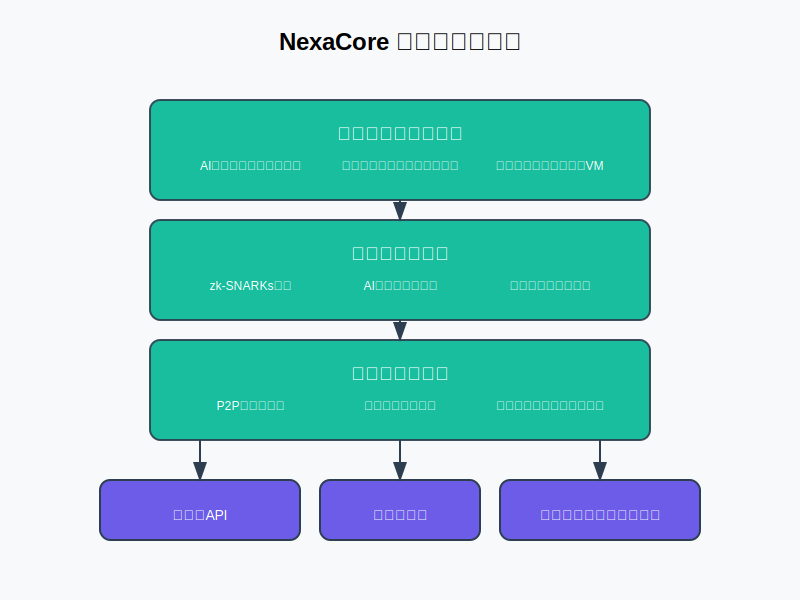
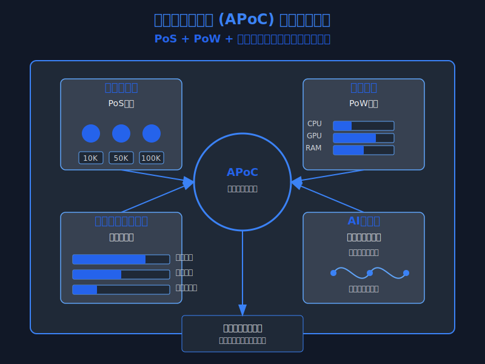

# NexaCore - AI統合型次世代ブロックチェーン

[](https://github.com/enablerdao/NexaCore/stargazers)
[](https://github.com/enablerdao/NexaCore/network/members)
[](https://github.com/enablerdao/NexaCore/issues)
[](https://github.com/enablerdao/NexaCore/blob/main/LICENSE)
[](https://app.netlify.com/sites/nexacore/deploys)

> **開発進捗状況**: 初期実装段階 | コア機能開発中 | 35 Rustファイル | 最終更新: 2025年3月
>
> NexaCoreは初期実装段階にあり、基本的なブロックチェーン機能（トランザクション処理、スマートコントラクト）の開発が進行中です。コアプロトコルの設計が完了し、Rustによる実装が進んでいます。テストネットの準備も始まっています。

<p align="center">
  
</p>

```
 _   _                  _____
| \ | | _____  ____ _  / / __|___  _ __ ___
|  \| |/ _ \ \/ / _` |/ / /  / _ \| '__/ _ \
| |\  |  __/>  < (_| / / /__| (_) | | |  __/
|_| \_|\___/_/\_\__,_/_/\____\___/|_|  \___|
```

NexaCore は、AI統合、シャーディング、zk-SNARKsを特徴とする次世代ブロックチェーンプラットフォームです。高度なスケーラビリティ、プライバシー保護、AIによる最適化を実現します。Rustで実装された安全なコードベースと革新的なコンセンサスメカニズムにより、高性能で信頼性の高いブロックチェーンインフラストラクチャを提供します。

## 主な特徴

### ハイブリッドスケーラビリティ
- **シャーディング + レイヤー0アプローチ**: ネットワークを動的に分割し、基盤層で異なるチェーン間の通信を最適化
- **目標パフォーマンス**: 100,000+ TPS（1秒あたりのトランザクション数）
- **適応型シャード割り当て**: ネットワーク負荷に応じてシャード数と構成を動的に調整
- **クロスシャード通信プロトコル**: 高効率なシャード間データ交換メカニズム

### モジュラー設計
- **プラグイン可能なコンポーネント**: 金融、ゲーム、データストレージなど、様々な用途に合わせてカスタマイズ可能な機能
- **拡張可能なAPI**: サードパーティ開発者が新機能を容易に追加できるインターフェース
- **マイクロサービスアーキテクチャ**: 独立して進化・スケールできる分離されたサービス

### ゼロ知識プライバシー
- **zk-SNARKs統合**: 検証可能性を維持しながらトランザクションのプライバシーを確保
- **選択的開示**: ユーザーが共有する情報を細かく制御可能
- **プライバシー保護スマートコントラクト**: 機密データを保護しながら複雑なロジックを実行

### AI駆動の最適化
- **リアルタイムの負荷分散AI**: 手数料とトランザクションルーティングを最適化
- **異常検出**: 不正行為や攻撃パターンをリアルタイムで識別
- **予測的スケーリング**: 将来の需要を予測し、事前にリソースを割り当て

### 自己アップグレード機能
- **オンチェーンガバナンス**: プロトコル更新に関するコミュニティ投票システム
- **自動アップグレード**: ハードフォークを必要としない円滑なプロトコル更新
- **バージョン互換性**: 異なるバージョンのノード間での互換性を確保

## コンセンサスアルゴリズム: 適応型貢献証明 (APoC)

<p align="center">
  
</p>

```
┌───────────────────────────────────────────────────────┐
│                                                       │
│  ┌─────────────┐      ┌─────────────┐      ┌─────────────┐  │
│  │   ステーク   │      │  計算貢献   │      │ ネットワーク │  │
│  │    (PoS)    │  +   │   (PoW)    │  +   │  貢献スコア  │  │
│  └─────────────┘      └─────────────┘      └─────────────┘  │
│                                                       │
│                 Adaptive Proof of Contribution        │
└───────────────────────────────────────────────────────┘
```

APoCは、Proof of Stake（PoS）とProof of Work（PoW）の利点を組み合わせ、さらに貢献指標を追加したコンセンサスアルゴリズムです：

- **ステーク量**: ネットワークへの経済的コミットメント（PoS要素）
  - **二次関数的重み付け**: 大規模ステーカーの支配を防止する非線形ステーク評価
  - **ロックアップ期間ボーナス**: 長期コミットメントに対する追加報酬
  - **スラッシング条件**: 悪意ある行動に対するペナルティメカニズム

- **計算貢献**: リソース提供（PoW要素）
  - **エネルギー効率の高い計算タスク**: 無駄なハッシュ計算を避け、有用な計算作業に焦点
  - **ハードウェア多様性**: 特殊なハードウェアよりも汎用コンピューティングを優遇
  - **リソース証明**: 提供されたコンピューティングリソースの検証可能な証明

- **ネットワーク貢献スコア**: トランザクション検証、バグ報告、オープンソース貢献などに対する報酬
  - **評判システム**: 過去の行動に基づく信頼スコア
  - **技術的貢献**: コード貢献、バグ報告、ドキュメント作成などの評価
  - **コミュニティ参加**: ガバナンス参加、教育活動、コミュニティサポートの評価

このアプローチは、PoSのエネルギー効率を維持しながら、PoWのセキュリティを保持し、貢献スコアを通じて中央集権化を防止します。

### APoC検証プロセス

1. **バリデーター候補の選出**: ステーク量、計算貢献、ネットワーク貢献スコアの加重合計に基づいて候補を選出
2. **ランダム委員会形成**: 選出された候補からランダムに検証委員会を形成
3. **ブロック提案と検証**: 委員会メンバーがブロックを提案し、他のメンバーが検証
4. **コンセンサス達成**: 委員会の2/3以上の合意によりブロックを確定
5. **報酬分配**: 貢献度に応じて報酬を分配

## ユニークな特徴

### AIとブロックチェーンの融合
- **AIがトランザクションルーティングとスマートコントラクトのデバッグを支援**
  - **インテリジェントルーティング**: AIがネットワーク状態を分析し、最適なトランザクション経路を選択
  - **コード分析**: AIがスマートコントラクトの脆弱性を自動検出
  - **自己修復メカニズム**: 一部の問題を自動的に修正する能力

### 動的ガバナンスモデル
- **投票権はステーク量と貢献スコアに依存**
  - **二次投票システム**: 投票力が単純なトークン保有量に比例しない公平なシステム
  - **専門知識の重み付け**: 特定の提案に関連する専門知識を持つ参加者の投票に追加の重み
  - **長期参加者優遇**: 長期的なネットワーク参加者に追加の投票権

- **AIが投票パターンを分析し、不正投票を防止**
  - **異常投票パターン検出**: 協調攻撃や買収投票の識別
  - **シミュレーションベースの影響分析**: 提案された変更の潜在的影響をシミュレーション
  - **透明性レポート**: ガバナンス活動の包括的な分析と可視化

### 開発者テンプレート
- **DApp開発を容易にする「プラグアンドプレイ」モジュール**
  - **事前構築されたコンポーネント**: 一般的な機能のための再利用可能なモジュール
  - **視覚的開発ツール**: コードを書かずにアプリケーションを構築するためのインターフェース
  - **自動テストと検証**: 組み込みのセキュリティチェックと最適化ツール

## プロジェクト構造

```
NexaCore/
├── src/                          # バックエンドソースコード (Rust)
│   ├── bin/                      # 実行可能バイナリ (ツール)
│   ├── core/                     # コア機能 (ライブラリ)
│   ├── network/                  # ネットワーク関連コード
│   ├── smartcontracts/           # スマートコントラクトエンジン
│   ├── ai/                       # AI統合モジュール
│   ├── wallets/                  # ウォレット機能
│   ├── lib.rs                    # ライブラリエントリポイント
│   └── main.rs                   # ノードメイン実行可能ファイル
├── frontend/                     # Web UI (JavaScript)
├── clients/                      # クライアントライブラリ
├── config/                       # 設定ファイル
├── docs/                         # ドキュメント
├── tests/                        # 統合テスト
├── scripts/                      # ビルドとデプロイメントスクリプト
├── data/                         # ブロックチェーンデータ
├── tools/                        # 開発および運用ツール
├── examples/                     # サンプルDApps
│   ├── simple_payment/           # 支払いコントラクト例
│   └── voting/                   # 投票コントラクト例
├── security/                     # セキュリティ関連ファイル
├── ci/                           # CI/CD設定
├── modules/                      # サブモジュール
│   ├── privacy/                  # プライバシー機能 (zk-SNARKs)
│   └── interop/                  # クロスチェーン相互運用性
└── Cargo.toml                    # Rustパッケージ管理
```

## 始め方

### 前提条件

- Rust 1.60+
- Node.js 16+
- RocksDB

### ソースからのビルド

```bash
# リポジトリをクローン
git clone https://github.com/enablerdao/NexaCore.git
cd NexaCore

# プロジェクトをビルド
cargo build --release

# ノードを実行
./target/release/nexacore
```

### ノードの実行

```bash
# フルノードを起動
./target/release/nexacore node

# バリデータノードを起動
./target/release/nexacore node --validator
```

### ウォレットの作成

```bash
# 新しいウォレットを初期化
./target/release/nexacore init-wallet --name "MyWallet"
```

## サンプルDApps

NexaCoreには、その機能を示すサンプルDAppsが含まれています：

### シンプル決済コントラクト

ユーザーがトークンを入金、引き出し、転送できる基本的な決済コントラクト。

### 投票コントラクト

提案作成、貢献スコアに基づく重み付け投票、結果検証を備えた投票システム。

## 技術仕様

### パフォーマンス指標

- **トランザクション処理**: 単一シャードで10,000+ TPS、マルチシャードで100,000+ TPS
- **ブロック時間**: 平均0.5秒
- **ファイナリティ**: 1.5秒以内
- **ストレージ効率**: 高度な圧縮と剪定技術による最小ディスク使用量

### セキュリティ機能

- **形式検証**: 重要なコンポーネントの数学的検証
- **セキュリティ監査**: 定期的な第三者監査
- **バグ報奨金プログラム**: セキュリティ研究者向けのインセンティブ
- **多層防御**: 複数の独立したセキュリティレイヤー

### ネットワークトポロジー

- **階層型P2Pネットワーク**: 効率的なメッセージ伝播のための最適化された構造
- **動的ピア発見**: 地理的位置と接続品質に基づく最適なピア選択
- **耐障害性ルーティング**: ネットワーク分断に対する堅牢性

## 貢献

貢献を歓迎します！詳細は[CONTRIBUTING.md](docs/CONTRIBUTING.md)をご覧ください。

## ライセンス

このプロジェクトはMITライセンスの下で提供されています - 詳細は[LICENSE](LICENSE)ファイルをご覧ください。

## ロードマップ

- **フェーズ1**: 基本的なシャーディングを備えたコア実装
- **フェーズ2**: AI統合とzk-SNARKs実装
- **フェーズ3**: クロスチェーン相互運用性
- **フェーズ4**: 高度な機能（量子耐性、メタバース統合など）

### 詳細なロードマップ

- **2025年Q1-Q2**: コアプロトコル実装、テストネット立ち上げ
- **2025年Q3-Q4**: AI統合、プライバシー機能、開発者ツール
- **2026年Q1-Q2**: メインネット準備、セキュリティ監査、パフォーマンス最適化
- **2026年Q3**: メインネットローンチ、エコシステム拡大プログラム開始

## 関連プロジェクト

EnablerDAOが開発する他のブロックチェーンプロジェクトもご覧ください：

- [NovaLedger](https://github.com/enablerdao/NovaLedger) - 超高速処理、高スケーラビリティ、量子耐性、AIによる最適化を特徴とする次世代ブロックチェーン技術
- [OptimaChain](https://github.com/enablerdao/OptimaChain) - 革新的なスケーリング技術と高度なセキュリティを統合した分散型ブロックチェーンプラットフォーム
- [NeuraChain](https://github.com/enablerdao/NeuraChain) - AI、量子耐性、スケーラビリティ、完全な分散化、エネルギー効率を統合した次世代ブロックチェーン
- [PulseChain](https://github.com/enablerdao/PulseChain) - リアルタイム処理、環境融合、人間性を重視した全く新しいレイヤーワンブロックチェーン
